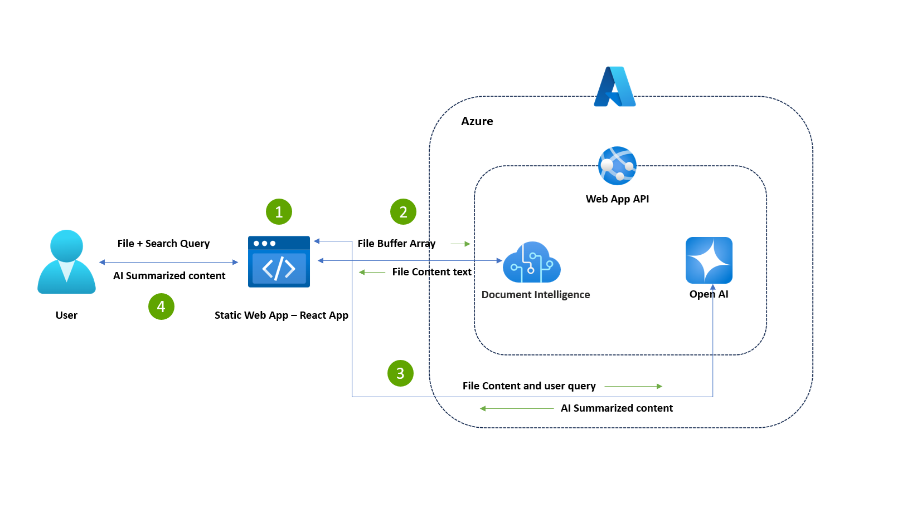

# Document Assistant API

## Overview
The Document Assistant API is a .NET 6.0 web API that leverages Azure Cognitive Services and OpenAI to read and summarize documents. It provides endpoints to read document content and generate summaries based on user queries.

## Architecture Diagram



## Project Structure
```
AzDocumentReadOpenAIAPI/
├── .vs/
│   ├── AzDocumentReadOpenAIAPI/
│   │   ├── config/
│   │   ├── DesignTimeBuild/
│   │   ├── FileContentIndex/
│   │   ├── ProjectEvaluation/
│   │   ├── azdocumentreadopenaiapi.metadata.v5.1
│   │   ├── azdocumentreadopenaiapi.projects.v5.1
│   │   ├── sd/
├── bin/
│   ├── Debug/
│   ├── Release/
├── obj/
├── Controllers/
│   ├── AzServicesController.cs
├── Properties/
│   ├── ...
├── appsettings.json
├── appsettings.Development.json
├── AzAIForm.cs
├── AzOpenAI.cs
├── Summary.cs
├── AzDocumentReadOpenAIAPI.csproj
├── AzDocumentReadOpenAIAPI.csproj.user
├── AzDocumentReadOpenAIAPI.sln
├── Program.cs
├── README.md
```

## Prerequisites
- **.NET 6.0 SDK**
- **Azure Cognitive Services Form Recognizer**
- **Azure OpenAI Service**

## Configuration
### 1. `appsettings.json`
Configure your Azure Cognitive Services and OpenAI credentials:
```json
{
  "AIServiceEndPoint": "Your Azure OpenAI Endpoint",
  "AIServiceKey": "Your Azure OpenAI Key",
  "AIServiceDeploymentName": "Your Azure OpenAI Deployment Name"
}
```

### 2. Environment Variables
Alternatively, you can set the following environment variables:
- `AIServiceEndPoint`
- `AIServiceKey`
- `AIServiceDeploymentName`

## Building and Running
1. **Restore Dependencies**:
   ```bash
   dotnet restore
   ```

2. **Build the Project**:
   ```bash
   dotnet build
   ```

3. **Run the Project**:
   ```bash
   dotnet run
   ```

## API Endpoints

### Read Document
- **URL**: `/api/AzServices/ReadDocument`
- **Method**: `POST`
- **Description**: Reads the content of a document from the request body.
- **Request Body**: Binary stream of the document.
- **Response**: JSON containing the document content.

### Summarize Document
- **URL**: `/api/AzServices/SummarizeDocument`
- **Method**: `POST`
- **Description**: Summarizes the content of a document based on a user's query.
- **Request Body**: JSON object containing `Content` and `Query`.
- **Response**: JSON containing the summarized content.

## Code Overview

### `Program.cs`
The entry point of the application. Configures services and middleware.

### `AzAIForm.cs`
Handles reading documents using Azure Cognitive Services Form Recognizer.

### `AzOpenAI.cs`
Handles summarizing documents using Azure OpenAI.

### `Controllers/AzServicesController.cs`
Defines the API endpoints for reading and summarizing documents.

### `Summary.cs`
Defines the `Summary` model used in the `SummarizeDocument` endpoint.

## License
This project is licensed under the MIT License.

